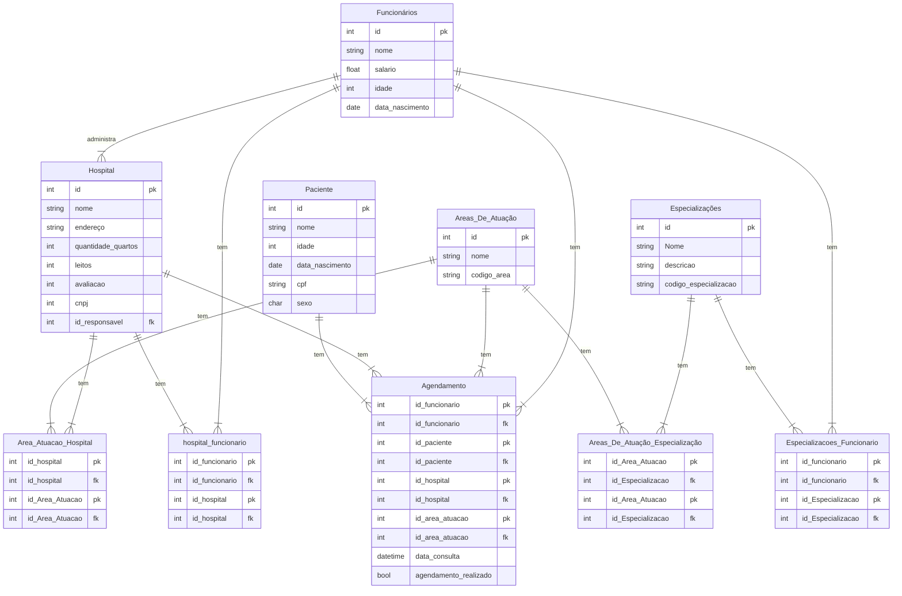

# Projeto 2 de banco de dados

# Alunos
 - Giovanni Chahin Morassi 22123025-3
 - Tiago Fagundes 22123017-0
 - Herinque Finatti 22123030-3

# Tema Escolhido: Sistema de Convenio

```mermaid
erDiagram

    Paciente || -- |{ Agendamento : tem 
    Hospital || -- |{ Agendamento : tem 
    Areas_De_Atuação || -- |{ Agendamento : tem 
    Funcionários || -- |{ Agendamento : tem 
    Areas_De_Atuação || -- |{ Area_Atuacao_Hospital : tem
    Hospital || -- |{ Area_Atuacao_Hospital : tem
    Especializações || -- |{ Especializacoes_Funcionario : tem
    Funcionários || -- |{ Especializacoes_Funcionario : tem
    Hospital || -- |{ hospital_funcionario : tem
    Funcionários || -- |{ hospital_funcionario : tem
    Funcionários || -- |{ Hospital: administra
    Areas_De_Atuação || -- |{ Areas_De_Atuação_Especialização : tem
    Especializações || -- |{ Areas_De_Atuação_Especialização : tem

    


    Paciente {
        int id pk
        string nome 
        int idade
        date data_nascimento
        string cpf
        char sexo
        
    }

    Agendamento {
        int id_funcionario pk
        int id_funcionario fk
        int id_paciente pk
        int id_paciente fk
        int id_hospital pk
        int id_hospital fk
        int id_area_atuacao pk
        int id_area_atuacao fk
        datetime data_consulta  
        bool agendamento_realizado  

    }

    Funcionários {
        int id pk
        string nome
        float salario
        int idade
        date data_nascimento

        
    }

    Areas_De_Atuação {
        int id pk
        string nome
        string codigo_area
        
    }

    Especializações {
        int id pk
        string Nome 
        string descricao
        string codigo_especializacao
    }

    Hospital {
        int id pk
        string nome
        string endereço
        int quantidade_quartos
        int leitos
        int avaliacao
        int cnpj
        int id_responsavel fk


    }

    Area_Atuacao_Hospital {
        int id_hospital pk
        int id_hospital fk
        int id_Area_Atuacao pk
        int id_Area_Atuacao fk
    }

    Especializacoes_Funcionario {
        int id_funcionario pk
        int id_funcionario fk
        int id_Especializacao pk
        int id_Especializacao fk
    }
    hospital_funcionario {
        int id_funcionario pk
        int id_funcionario fk
        int id_hospital pk
        int id_hospital fk
    }
    Areas_De_Atuação_Especialização{
        int id_Area_Atuacao pk
        int id_Especializacao fk
        int id_Area_Atuacao pk
        int id_Especializacao fk
    }


```

