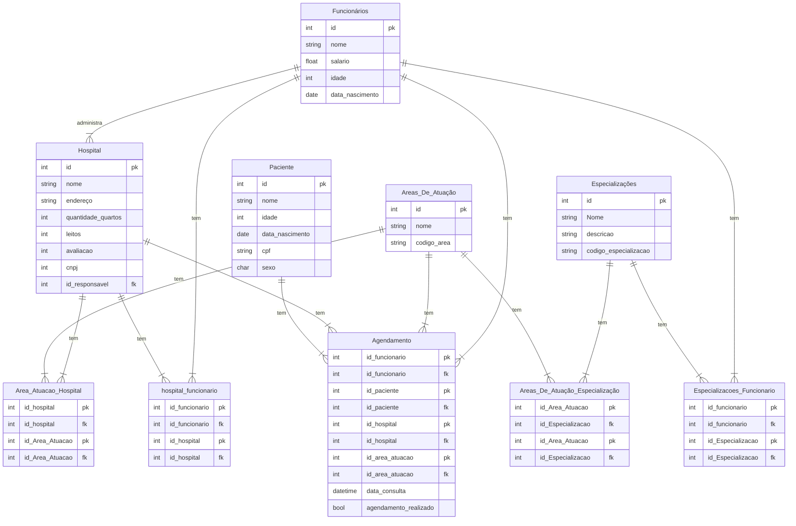

# Projeto 2 de banco de dados:

# Alunos
 - Giovanni Chahin Morassi 22123025-3
 - Tiago Fagundes 22123017-0
 - Herinque Finatti 22123030-3

# Tema Escolhido: Sistema de Convenio



# Resumo do projeto

Escolhemos fazer um projeto de Sistemas de Convenio, contendo todas as tabelas descritas no diagrama, criamos 4 relações N:M, alem de algumas simples relações 1:M.

Criamos as tabelas e FKs no arquivo [CreateTable](CreateTable.sql) e populamos o banco no arquivo [AlimentarBanco](AlimentarBanco.py)

Iniciamos pelo diagrama de relação de entidade, feito usando mermaid no markdown.
Criamos os script para a crição as tabelas, e depois fizemos todas as foreign keys, colocando todos no arquivo [CreateTable](CreateTable.sql)
Temos os Selects feito em cima dos dados no arquivo [Consultas](Consultas.sql)
Ja os dados foram criados a partir do faker no arquivo python [AlimentarBanco](AlimentarBanco.py)
O Schema é criado a partir do python, que a partir do Sql Alchemy inspeciona o banco de dados criado e gera automaticamente o schema em um arquivo markown [Schema](Schema.md)
Utilizamos muito do que foi feito em projetos anteriores para nos orientarmos e seguirmos com um padrão, por isso da escolha do python criando todo o script para a automatização da criação dos bancos e população.


# Como Rodar

Fizemos um script completo, que contem na primeira linha a url de conexão do nosso banco para conectar utilizando o dbeaver ou outra IDE de banco de dados, que vai alem de executar a query armazenada no arquivo [CreateTable](CreateTable.sql), ele vai criar os dados através da biblioteca faker do python, e de alguns exemplos de nomes prédefinidos.
Ele vai criar em ordem de importancia na relação, então ja garante a existencia de relação, por exemplo, o agendamento tem que conter os id ja criados nas tabelas correspondentes

## Passo a Passo (Windows)
1. Clonar o projeto 
1. Criar um ambiente virtual (recomendado python na versão 3.12.*) ```python -m venv venv```
1. Ativar o ambiente virtual ```venv\Scripts\Activate```
1. Instalar as dependencias utilizadas citadas no documento [requirements](requirements.txt) ```pip install -r requirements.txt```
1. Rodar o python ```python alimentarBanco.py``` (Vale lembrar que o python está com as informações de conexão a banco de dados do nosso projeto, então o será necessário inserir as informações para o seu banco postgres)

# O que o python faz?
O python vai criar o banco utilizando o ddl descrito no arquivo [montaBanco](CreateTable.sql)
Ele inserir os dados e verificar as relações, garantindo que exista relação entre as tabelas de acordo com o diagrama

## Como ele verifica a integridade?
O python vai analisar o schema, montar querys a partir das Fks, e a partir das querys de verificação descritas de todas as relações, ele vai dizer caso funcione ou não


